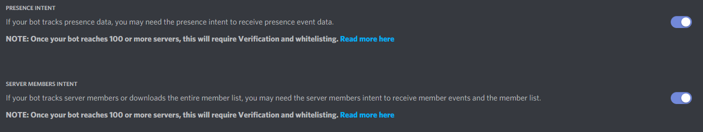
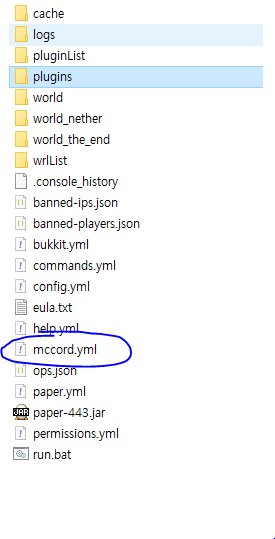
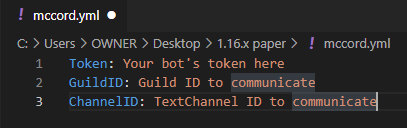

# MCcord(available on 1.16.x)

You can communicate with users between Minecraft & Discord!

# Features(v1.0.0)

- Support mentionable(Only Discord -> Minecraft)
- Display player join/quit event
- Display player death event

# How to use?

1. Download jar file [here](https://github.com/acceler8tion/MCcord/releases/download/1.0.0/MCcord.jar) and put your server plugin folder.

2. Create your own discord application(for bot) [here](https://discord.com/developers/).

3. Enable `PRESENCE INTENT` and `SERVER MEMBER INTENT`

4. Create `mccord.yml` file from your server folder

5. Refer to the form and fill it in.

6. The end. Start your server!

# Credit

Discord: acceler8tion#3350

Issues & Pull requests are welcome!
